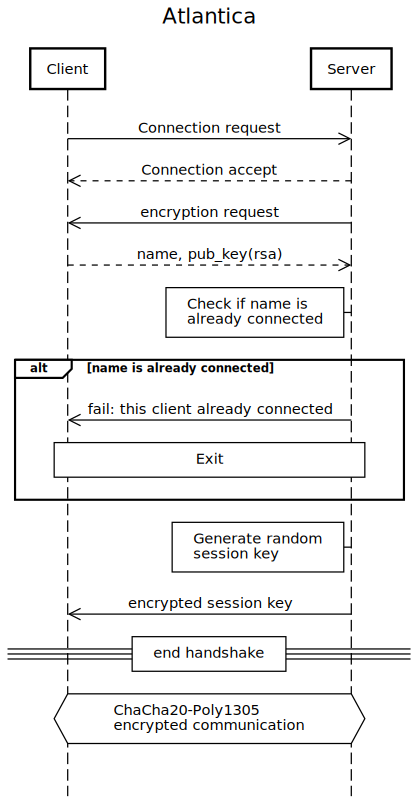

# Networking
Atlantica uses a client server model independent of the mode, for single player mode the
server does not have to open any ports on a network, it can just open the ports to the
localhost.

- Data is send over the network using utf-8 encode json strings. These strings encode lists.
- List element 0 is a command, the other elements are arguments.

## Encrytion
The traffic is encrypted with ChaCha20-Poly1305 symmetric enryption.
The shared secret is created by the server and send to the
client, encrypted with the clients public key.

## Authentification
When connecting to the server the user sends its name and public key. The first
time the user connects the public key is saved on the server side. When the client
connects the next time the server checks if the public key matches with the saved
public key. Because the AES secret is send to the client encrypted with the public
key, it is not possible to steal the client name.

This way it is possible to choose any username, which is not already taken
and users can reconnect with their name, while no one else is abled to steel
a users name. Additionaly users do not have to use passwords.

## The client
The client handles the first stage of [The Parser](#the-parser).
Then the client replaces all known aliases, with their values.
It also checks if the
string at index 0 matches a client side command. If the string does, the client executes the client
side command. Else the client sends the wordlist to the server.

### Client side commands
- connect to server (args: ip, port) > connects the client to the server
- set name (args: new name) > sets the player name, which will be used to connect to the server
- clear (args: none) > clears the screen
- quit game (args: none) > saves and exits the game
- add alias (args: what to alias, alias name) > add an alias to the aliases list
- print alias (args: none) > prints all aliases
- print help (args: none) > prints all available commands

## The server
The server handles the clients, as well as the game state. The server uses multithreading, to accept multiple clients. The server also handles the [second](#second-stage) and [third stage](#third-stage) of the [parser](#the-parser). The server code contains all [game object](#game-objects) classes.

### Server side code
- Thread 1
  - accept connection requests from new clients
  - create a new thread for every client
- Thread
  - handle the [game state](#game-state)
- Per client threads
  - handle the commands that the client sends
    - handle [second](#second-stage) and [third stage](#third-stage) of the [parser](#the-parser)
    - execute the commands and send replies to the user

## Connection Diagram
This is a sequence diagram of the connection between the client and the server:

